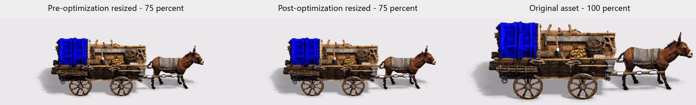

# SMX Workshop HQ SLD

Experimental private development mirror of
[ImWG/SMX-Workshop](https://github.com/ImWG/SMX-Workshop), focused on improving
SLD encoding quality for *Age of Empires: Definitive Edition* and
*Age of Empires II: Definitive Edition* graphics.

> [!IMPORTANT]
> SMX Workshop currently has no explicit repository license. Modified binaries
> are not distributed from this mirror while
> [upstream licensing issue #1](https://github.com/ImWG/SMX-Workshop/issues/1)
> remains unresolved.

## Comparison

Left to right:

1. Resized asset encoded by the existing SLD encoder
2. Resized asset encoded by the experimental high-quality encoder
3. Original unresized game asset

All three panels use the same animation sequence and timing. The optimized
output reduces frame-to-frame color instability while preserving the SLD's
structural and gameplay-relevant data.

## Problem

SLD normal-color data is stored as lossy 4x4 RGB tiles. The existing encoder
selects tile endpoints primarily from the darkest and brightest source pixels.

This is fast, but those endpoints do not always produce the lowest reconstructed
color error. Small endpoint changes between animation frames can also produce
visible static or flickering.

## Experimental Encoder

The validated prototype:

- Generates multiple candidate RGB565 endpoint pairs for each tile
- Reconstructs and evaluates each candidate against the target pixels
- Replaces a tile only when the candidate has strictly lower error
- Preserves the original visibility mask exactly
- Protects tiles overlapping player-color data
- Leaves shadows, player intensity, smudge data, anchors, and unrelated SLD
  chunks unchanged
- Produces deterministic output
- Supports bounded CPU usage and checkpointed processing

The existing encoder is intended to remain available as the fast mode. The new
encoder will be introduced as an optional high-quality mode.

## Mule Cart Results

| Graphic | RGB error | Temporal error |
|---|---:|---:|
| Destruction | 15.6034 -> 12.6909 | 3.9734 -> 3.3215 |
| Rubble | 18.6744 -> 15.0890 | 2.1872 -> 1.7146 |
| Death | 10.9486 -> 9.0020 | 5.7803 -> 4.8964 |
| Decay | 13.2009 -> 11.6224 | 5.7441 -> 5.0421 |
| Walk | 10.0276 -> 8.2067 | 3.7062 -> 3.1613 |
| Foundation | 13.7410 -> 11.1276 | 7.6318 -> 6.2619 |

Validation detected zero changes to:

- Visibility and alpha masks
- Player-color output
- Shadows
- Anchors
- Non-normal SLD chunks

## Development Plan

1. Port the validated encoder into Java
2. Add fast and high-quality SLD encoding modes
3. Add deterministic tile-level tests
4. Add rendered-image and temporal regression tests
5. Benchmark quality, runtime, memory usage, and file size
6. Prepare a focused contribution for the original project if welcomed

## Repository Relationship

- `origin` points to this private development mirror
- `upstream` points to
  [ImWG/SMX-Workshop](https://github.com/ImWG/SMX-Workshop)
- `master` tracks the imported upstream history
- `hq-sld-encoder` contains experimental development

The repository preserves upstream commit history so changes can be reviewed and
rebased cleanly if the maintainer welcomes a contribution.
